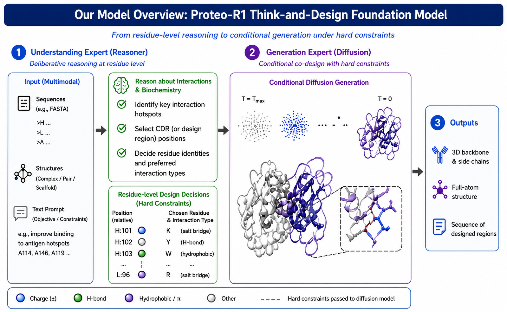

<p align="center">
  
</p>

<h1 align="center">
Proteo-R1: Reasoning Foundation Models for De Novo Protein Design
</h1>

<p align="center">
Open-source inference toolkit for de novo protein design: a reasoning-capable
understand model (Qwen3 + ESM-2 + AF3-like encoder) paired with a AF3-like structure
generator.
</p>

<div align="center">
  <a href="https://smiles724.github.io/r1/"></a>
  <a href="https://arxiv.org/abs/2605.02937"></a>
  <a href="https://huggingface.co/thinking-bio-lab/proteor1-understand"></a>
  <a href="https://huggingface.co/thinking-bio-lab/proteor1-generate"></a>
  <a href="https://github.com/smiles724/Proteo-R1"></a>
</div>

<br>

<p align="center">
  <a href="https://www.stanford.edu/"></a>&nbsp;&nbsp;&nbsp;&nbsp;
  <a href="https://www.harvard.edu/"></a>&nbsp;&nbsp;&nbsp;&nbsp;
  <a href="https://www.u-tokyo.ac.jp/en/"></a>&nbsp;&nbsp;&nbsp;&nbsp;
  <a href="https://www.cuhk.edu.hk/"></a>&nbsp;&nbsp;&nbsp;&nbsp;
  <a href="https://www.amazon.science/"></a>&nbsp;&nbsp;&nbsp;&nbsp;
</p>

## Model overview

**Proteo-R1 think-and-design:** residue-level reasoning in the **understand**
expert (Qwen3 + Protenix), then conditional diffusion in the **generate** expert
(Boltz1) with hard constraints from the design decisions.

<p align="center">
  
</p>

## Quickstart

End-to-end run = one CDR-preparation step + one structure-design step.
Both checkpoints are pulled from HF Hub automatically (no manual download
required):

```bash
# Step 1: emit per-CDR hidden states (text-side Qwen3 forward over the
# X-masked input CIF).
proteor1-prepare-cdr \
  --cif data/demo/8q7o_A__C/8q7o_A__C.cif \
  --design-points "$(cat data/demo/8q7o_A__C/design_points.txt)" \
  --out work/smoke/prepare_cdr \
  --record-id 8q7o_A__C \
  --emit-cdr-hidden \
  --understand-ckpt thinking-bio-lab/proteor1-understand \
  --override

# Step 2: structure design with framework inpainting from the GT scaffold.
# Uses the bundled canonical YAML (spec_mask schema; token-aligned with the
# GT structure under data/demo_gt_structures/) instead of prepare-cdr's
# emitted YAML.
proteor1-design \
  --input_dir data/demo_canonical_yamls/8q7o_A__C.yaml \
  --output work/smoke \
  --checkpoint thinking-bio-lab/proteor1-generate \
  --precomputed_cdr_dir work/smoke/prepare_cdr/8q7o_A__C/cdr_hidden \
  --processed_msa_dir data/demo_msa \
  --structure_inpainting \
  --ground_truth_structure_dir data/demo_gt_structures \
  --no_cdr_json \
  --override
```

`--structure_inpainting` is **required** for the published quality target:
framework Cα RMSD drops from ~16 Å (raw diffusion) to ~1 Å (GT-anchored),
and CDR AAR improves 2-5×. The three flag pairs below are the inpaint
prerequisites:

- `--input_dir data/demo_canonical_yamls/<entry>.yaml` — canonical
  spec_mask YAML, token-count-aligned with the GT npz.
- `--processed_msa_dir data/demo_msa` — preprocessed MSA `.npz` shards
  per chain (Boltz1 expects them).
- `--ground_truth_structure_dir data/demo_gt_structures` — Boltz1
  internal Structure-format `<record_id>.npz` files used as the frozen
  scaffold during diffusion.

All three asset directories are bundled with the repo for the 5 demo
entries; bring your own equivalents to run on arbitrary CIFs (see the
`scripts/phase0/run_stage3.py` template in the upstream
`proteinfm_joint_train` for how the canonical YAML / npz are produced).

The two checkpoints live at:

- [`thinking-bio-lab/proteor1-understand`](https://huggingface.co/thinking-bio-lab/proteor1-understand)
  — Qwen3-4B + Protenix encoder; emits CDR sequence candidates + hidden states
- [`thinking-bio-lab/proteor1-generate`](https://huggingface.co/thinking-bio-lab/proteor1-generate)
  — Boltz1 diffusion; consumes hidden states + emits 3D atomic coordinates

Both flags also accept a local path if you've already downloaded the
checkpoints (e.g., `--understand-ckpt pretrained/proteor1_understand`).

The repository ships 5 demo entries under `data/demo/` (1 nano antibody +
4 paired heavy/light antibodies) so you can run the Quickstart against any
of them by swapping the `8q7o_A__C` identifier.

### CPU-only sanity check

No GPU? Use the example wrapper with `--dry-run` to validate the install +
CLI plumbing without loading model weights:

```bash
python examples/inference_demo.py --demo-entry 8q7o_A__C --out work/demo --dry-run

# Or, on GPU, exercise the same opt-in inpainting plumbing the Quickstart
# block exposes (requires <record_id>.npz files in Boltz1 internal format
# under --ground-truth-structure-dir; OFF by default):
python examples/inference_demo.py --demo-entry 8q7o_A__C --out work/demo \
  --structure-inpainting --ground-truth-structure-dir path/to/gt_npz_dir
```

### Reproducibility note

Sampling at non-zero temperature plus CUDA kernel implementation
differences across torch / GPU versions mean **single-trial outputs are
not bit-exact reproducible across environments, even at the same seed**.
Per-entry numbers can fluctuate noticeably run-to-run; aggregates across
multiple entries (or multiple trials per entry) are far more stable.

## Installation
> **Important — Protenix encoder is a mandatory editable install.**
> `proteor1.understand` imports `protenix.*` directly, but `pyproject.toml`
> excludes `external/` from the package distribution because we pin to a
> specific commit of the [`smiles724/protenix_dev`](https://github.com/smiles724/protenix_dev)
> fork (git submodule). The only way to satisfy
> the import is **Step 3** (`pip install -e ./external/protenix_dev`).
> Skipping it produces:
>
> ```
> ImportError: No module named 'protenix'
> ```

```bash
# 1. Dedicated conda env (matches the transformers==4.57.1 pin used by the upstream Qwen3 + Boltz1 stack)
conda create -n proteor1 python=3.12 -y
conda activate proteor1

# 2. Clone with the Protenix encoder submodule
git clone --recurse-submodules https://github.com/smiles724/Proteo-R1.git ProteoR1
cd ProteoR1
#    If you already cloned without --recurse-submodules:
#        git submodule update --init --recursive
#    If `external/protenix_dev` still points at an old remote after pulling:
#        git submodule sync --recursive && git submodule update --init --recursive

# 3. Editable install of the Protenix encoder (lives under external/protenix_dev/)
#    MANDATORY — proteor1.understand depends on this for chain-extracted CIF → embedding dump.
pip install -e ./external/protenix_dev
#    Fail-fast verify before continuing:
python -c "import protenix; print('protenix encoder import OK')"

# 4. Protenix encoder runtime dependencies
pip install -U \
    ml_collections==1.1.0 \
    fair-esm==2.0.0 \
    optree==0.17.0 \
    rdkit==2023.9.6 \
    numpy==1.26.4 \
    biotite==1.4.0 \
    cuequivariance-ops-torch-cu12==0.6.1 \
    cuequivariance-torch==0.6.1

# 5. Download Protenix CCD data (Chemical Component Dictionary cache for CIF parsing)
mkdir -p external/protenix_dev/release_data/ccd_cache
cd external/protenix_dev/release_data/ccd_cache
wget https://af3-dev.tos-cn-beijing.volces.com/release_data/components.v20240608.cif
wget https://af3-dev.tos-cn-beijing.volces.com/release_data/components.v20240608.cif.rdkit_mol.pkl
cd -

# 6. Download Protenix pretrained weights (~7 GB total: ESM2 + protenix mini)
mkdir -p pretrained/protenix_mini_ism_v0.5.0
cd pretrained/protenix_mini_ism_v0.5.0
wget https://af3-dev.tos-cn-beijing.volces.com/release_model/esm2_t36_3B_UR50D_ism.pt
wget https://af3-dev.tos-cn-beijing.volces.com/release_model/protenix_mini_ism_v0.5.0.pt
cd -

# 7. Download Boltz1 vendor CCD cache (~330 MB; required at design-time by
#    proteor1.generate.inference.process_inputs to parse residue chemistry).
#    Default `--cache` path is `ckpts/upstream/`; file must land at
#    ckpts/upstream/ccd.pkl. Source: clorf6/MF-Design HF mirror.
mkdir -p ckpts/upstream
wget -O ckpts/upstream/ccd.pkl \
    https://huggingface.co/clorf6/MF-Design/resolve/main/model/ccd.pkl
#    Fail-fast verify (pickle loads without error):
python -c "import pickle; pickle.load(open('ckpts/upstream/ccd.pkl', 'rb')); print('ccd.pkl OK')"

# 8. Install abnumber via bioconda (bundles a working HMMER binary, used for CDR detection).
#    Pure-pip `pip install abnumber` does NOT bring in `anarci`; bioconda does. Skip this step
#    and CDR detection at runtime will fail with `No module named 'anarci'`.
conda install -c bioconda abnumber anarci -y
#    Fail-fast verify:
python -c "import anarci; print('anarci import OK')"

# 9. Editable install of proteor1 (base deps from pyproject.toml)
pip install -e .

# 10. (Optional, GPU-only) flash-attn for the Qwen3 understanding model
#    Skip on CPU-only machines; falls back to eager attention automatically.
#    --no-build-isolation is required because flash-attn compiles against the
#    already-installed torch (~5-15 min on first install).
pip install flash-attn --no-build-isolation

# 11. (Optional, contributors) Dev tools for pytest + linting
pip install -e ".[dev]"

# 12. Verify the install
python -c "import proteor1; print('proteor1', proteor1.__version__)"
python -c "import protenix; print('protenix encoder OK')"
proteor1-prepare-cdr --help
proteor1-design --help
proteor1-cdr-hidden-emit --help
```

The ProteoR1 understand + generate checkpoints download automatically from
HF Hub on first inference (cached under
`~/.cache/huggingface/hub/`). If you prefer to pre-download them locally,
see the `thinking-bio-lab/proteor1-{understand,generate}` repos.

> **About `external/protenix_dev`**: this is the [Protenix](https://github.com/bytedance/Protenix)
> structure encoder, pulled as a git submodule from
> [`smiles724/protenix_dev`](https://github.com/smiles724/protenix_dev) rather
> than a PyPI dependency, because ProteoR1 pins to a specific commit of that fork.
> The pinned submodule commit is locked for each release (e.g. v0.1.0).

### Troubleshooting

- **`Chemical Component Dictionary cache not found`**: The Protenix CCD cache
  (`components.v20240608.cif.rdkit_mol.pkl`) defaults to
  `external/protenix_dev/release_data/ccd_cache/`. If you installed Protenix
  to a non-default path or want to share the cache across multiple checkouts
  (e.g., git worktrees), set:
  ```bash
  export PROTEOR1_CCD_CACHE=/absolute/path/to/ccd_cache
  ```
  Step 5 above downloads the cache to the default location; only set this
  env when you need to override that path.
- **`ImportError: No module named 'protenix'`**: You skipped install step 3
  (`pip install -e ./external/protenix_dev`). Re-run that step.
- **`flash-attn` build fails**: This is optional (step 9). Eager attention
  is selected automatically when `flash-attn` is missing; the demo pipeline
  still produces correct outputs, just slower on the forward pass.
- **`FileNotFoundError: ckpts/upstream/ccd.pkl`** at design time: You
  skipped install step 7 (Boltz1 vendor CCD cache, ~330 MB). Re-run step
  7's `wget` + verify. The default `--cache` directory is `ckpts/upstream`;
  pass `--cache <other_dir>` to `proteor1-design` if you placed the file
  elsewhere.
- **`No module named 'anarci'`** at CDR detection time: You skipped install
  step 8 (`conda install -c bioconda abnumber anarci -y`). `anarci` is a
  bioconda-only Python package that `abnumber` depends on at runtime; pure
  `pip install abnumber` does not pull it in. Re-run step 8.

## ProteoR1 team

We are grateful to our contributors and collaborators. Below are the core
authors listed on the paper.

<table>
  <tbody>
    <tr>
      <td align="center">
        <a href="https://github.com/smiles724">
          
          <br />
          <sub><b>Fang Wu</b></sub>
        </a>
      </td>
      <td align="center">
        <a href="https://weihaoxuan.com/">
          
          <br />
          <sub><b>Weihao Xuan</b></sub>
        </a>
      </td>
      <td align="center">
        
        <br />
        <sub><b>Heli Qi</b></sub>
      </td>
      <td align="center">
        
        <br />
        <sub><b>Hanqun Cao</b></sub>
      </td>
      <td align="center">
        
        <br />
        <sub><b>Heng-Jui Chang</b></sub>
      </td>
    </tr>
    <tr>
      <td align="center">
        
        <br />
        <sub><b>Li Erran Li</b></sub>
      </td>
      <td align="center">
        
        <br />
        <sub><b>Haokai Zhao</b></sub>
      </td>
      <td align="center">
        
        <br />
        <sub><b>Ma Jian</b></sub>
      </td>
      <td align="center">
        <a href="https://cs.stanford.edu/~jure/">
          
          <br />
          <sub><b>Jure Leskovec</b></sub>
        </a>
      </td>
      <td align="center">
        <a href="https://yejinc.github.io/">
          
          <br />
          <sub><b>Yejin Choi</b></sub>
        </a>
      </td>
    </tr>
  </tbody>
</table>

<p align="center"><sub>Additional contributors are acknowledged as <b>others</b> in the BibTeX entry below.</sub></p>

## License

Released under the Apache License, Version 2.0. See [LICENSE](LICENSE) for the
full text and [NOTICE](NOTICE) for upstream attribution (Boltz1 MIT, Protenix
Apache 2.0).

## Citation

If you find this study interesting and helpful, please cite this work using the following BibTeX entry:

```bibtex
@article{wu2026proteo,
  title={Proteo-R1: Reasoning Foundation Models for De Novo Protein Design},
  author={Wu, Fang and Xuan, Weihao and Qi, Heli and Cao, Hanqun and Chang, Heng-Jui and Zhou, Zeqi and Zhao, Haokai and Jian, Ma and Leskovec, Jure and Choi, Yejin and others},
  journal={arXiv preprint arXiv:2605.02937},
  year={2026}
}
```
